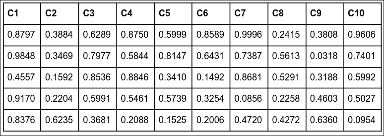

# GUIA TSD155 — COMPUTO 02

Cada ejercicio incluye el **comando listo para ejecutar**.
El script se maneja pasando entradas por stdin con `printf`.

```bash
# Formato general
printf "opcion\n[parametros...]\n0\n" | python3 simulacion_estadistica.py
```

---

## Ejercicio 1 — Período de generadores congruenciales

> **Flujo:** opción `5` → generador `1` → a → c → m → x0 → `0` (salir)

```bash
# 1.a  a=21  c=15  m=31   x0=21
printf "5\n1\n21\n15\n31\n21\n0\n"   | python3 simulacion_estadistica.py

# 1.b  a=13  c=9   m=128  x0=7
printf "5\n1\n13\n9\n128\n7\n0\n"    | python3 simulacion_estadistica.py

# 1.c  a=17  c=0   m=31   x0=23
printf "5\n1\n17\n0\n31\n23\n0\n"    | python3 simulacion_estadistica.py

# 1.d  a=1   c=121 m=256  x0=17
printf "5\n1\n1\n121\n256\n17\n0\n"  | python3 simulacion_estadistica.py
```

### 1.e — Generador de Segundo Orden (a=21, b=15, m=64, x0=21, x1=43, n=100)

> Genera la secuencia e identifica visualmente el ciclo. `9` = selección inválida (no corre pruebas).

```bash
printf "4\n21\n15\n64\n21\n43\n100\n\n9\n0\n" | python3 simulacion_estadistica.py
```

---

## Ejercicio 2 — Período de más generadores congruenciales

```bash
# 2.a  a=137 c=47  m=17  x0=17
printf "5\n1\n137\n47\n17\n17\n0\n"   | python3 simulacion_estadistica.py

# 2.b  a=191 c=17  m=23  x0=77
printf "5\n1\n191\n17\n23\n77\n0\n"   | python3 simulacion_estadistica.py

# 2.c  a=237 c=71  m=37  x0=27
printf "5\n1\n237\n71\n37\n27\n0\n"   | python3 simulacion_estadistica.py

# 2.d  a=117 c=31  m=19  x0=23
printf "5\n1\n117\n31\n19\n23\n0\n"   | python3 simulacion_estadistica.py

# 2.e  a=157 c=47  m=37  x0=29
printf "5\n1\n157\n47\n37\n29\n0\n"   | python3 simulacion_estadistica.py

# 2.f  a=321 c=11  m=27  x0=19
printf "5\n1\n321\n11\n27\n19\n0\n"   | python3 simulacion_estadistica.py
```

---

## Ejercicio 3 — Xj+1 = (553 + 121·Xj) mod 177,  X0 = 23

### 3.a — Calcular período (resultado: **87**)

```bash
printf "5\n1\n121\n553\n177\n23\n0\n" | python3 simulacion_estadistica.py
```

### 3.b — Generar 87 números y aplicar Pruebas de Media, Varianza y Uniformidad

> α = 0.05 | Pruebas: `1,2,3` | k = 10 intervalos

```bash
printf "2\n121\n553\n177\n23\n87\n0.05\n1,2,3\n10\n0\n" | python3 simulacion_estadistica.py
```

---

## Ejercicio 4 — Uniformidad, Series y Corridas A/B (primeros 100 números)

> α = 0.05 | Pruebas: `3,4,5` → pide k dos veces (uniformidad y series, ambas = 10)

```bash
# 4.a  a=1117  c=3057   m=1679567  x0=1457   n=100
printf "2\n1117\n3057\n1679567\n1457\n100\n0.05\n3,4,5\n10\n10\n0\n" | python3 simulacion_estadistica.py

# 4.b  a=2177  c=2367   m=1351867  x0=1117   n=100
printf "2\n2177\n2367\n1351867\n1117\n100\n0.05\n3,4,5\n10\n10\n0\n" | python3 simulacion_estadistica.py
```

---

## Ejercicio 5 — Números 101–200: Media, Varianza y Póker

> Usa como x0 el valor X₁₀₀ calculado a partir del generador del ejercicio 4.
> - **5.a**: X₁₀₀ del ej. 4.a = **1617073**
> - **5.b**: X₁₀₀ del ej. 4.b = **341666**
>
> α = 0.05 | Pruebas: `1,2,7` (Media, Varianza, Póker)

```bash
# 5.a  a=1117  c=3057   m=1679567  x0=1617073  n=100
printf "2\n1117\n3057\n1679567\n1617073\n100\n0.05\n1,2,7\n0\n" | python3 simulacion_estadistica.py

# 5.b  a=2177  c=2367   m=1351867  x0=341666   n=100
printf "2\n2177\n2367\n1351867\n341666\n100\n0.05\n1,2,7\n0\n"  | python3 simulacion_estadistica.py
```

---

## Ejercicio 6 — Cuadrados Medios: semilla 5735, n=50, nivel 90%

> α = 0.10 (nivel de aceptación 90%) | Prueba: `3` (Uniformidad) | k = 10

```bash
printf "3\n5735\n4\n50\n0.10\n3\n10\n0\n" | python3 simulacion_estadistica.py
```

---

## Ejercicio 7 — Pruebas a 50 números manuales (nivel 95%)

> α = 0.05 | Pruebas: `1,2,3` (Media, Varianza, Uniformidad) | k = 10

```bash
printf "1\n0.8797,0.3884,0.6289,0.8750,0.5999,0.8589,0.9996,0.2415,0.3808,0.9606,0.9848,0.3469,0.7977,0.5844,0.8147,0.6431,0.7387,0.5613,0.0318,0.7401,0.4557,0.1592,0.8536,0.8846,0.3410,0.1492,0.8681,0.5291,0.3188,0.5992,0.9170,0.2204,0.5991,0.5461,0.5739,0.3254,0.0856,0.2258,0.4603,0.5027,0.8376,0.6235,0.3681,0.2088,0.1525,0.2006,0.4720,0.4272,0.6360,0.0954\n0.05\n1,2,3\n10\n0\n" | python3 simulacion_estadistica.py
```



---

## Ejercicio 8 — Xj+1 = (71·Xj) mod 357, X0 = 167

### 8.a — Calcular período

```bash
printf "5\n1\n71\n0\n357\n167\n0\n" | python3 simulacion_estadistica.py
```

### 8.b — Corridas arriba/abajo y corridas de la media (n=100)

> α = 0.05 | Pruebas: `5,6` (Corridas A/B y Corridas Media)

```bash
printf "2\n71\n0\n357\n167\n100\n0.05\n5,6\n0\n" | python3 simulacion_estadistica.py
```
